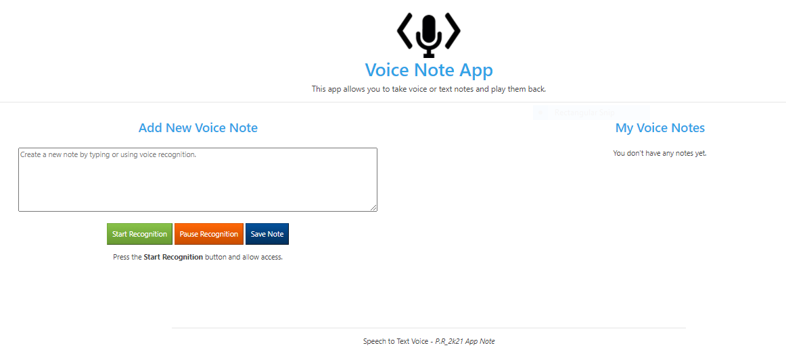

## <em>P.R_2k21</em> Voice Note-App

The purpose of this app is to experiment with the <b>Web Speech API</b> which enables you to incorporate voice data into web apps. The Web Speech API has two parts: SpeechSynthesis (Text-to-Speech), and SpeechRecognition (Asynchronous Speech Recognition.)

<b>This app uses the Web Speech API to build a voice powered note app to do 3 things:</b>

 <ul> Takes notes by using voice-to-text or keyboard input.</ul>
 <ul> Save voice notes to localStorage.</ul>
 <ul> Display all of the saved notes and give the option to either Listen to the Notes or delete them.</ul>

 

### Description

The Web Speech API provides two distinct areas of functionality —<i> speech recognition, and speech synthesis (also know as text to speech, or tts)</i> 

The Voice Note App will be separated into two seperate interfaces. The first will be the __"Speech Recognition"__ that will involve receiving speech through a device's microphone, which is then checked by a speech recognition service against a list of grammar (basically, the vocabulary you want to have recognised in a particular app.) When a word or phrase is successfully recognised, it is returned as a result (or list of results) as a text string, and further actions can be initiated as a result.

The second is __"Speech Synthesis"__ (aka text-to-speech, or tts) that involves receiving synthesising text contained within an app to speech, and playing it out of a device's speaker or audio output connection.
 

----

### What We Learned
- To work with the Web Speech API; speech recognition, and speech synthesis.
 

----

### Website Technologies Used

Description of website technologies used to develop this app.

- HTML
- CSS
- JavaScript
- Bootstrap
- Web Speech API
 

----
__New Year New Hack - Completed: 03/01/2k21__

[Demo - Click Here]() - __P.R_2k21 Voice Note-App__

__Note:__ On Chrome, using Speech Recognition on a web page involves a server-based recognition engine. Your audio is sent to a web service for recognition processing, so it won't work offline.
